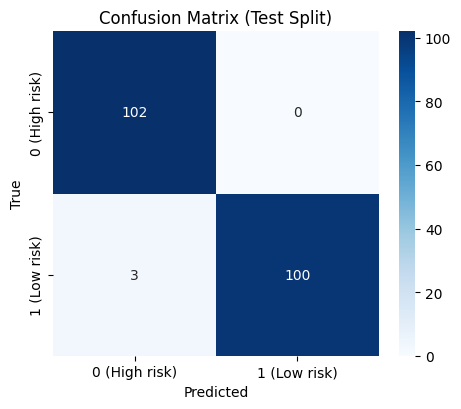
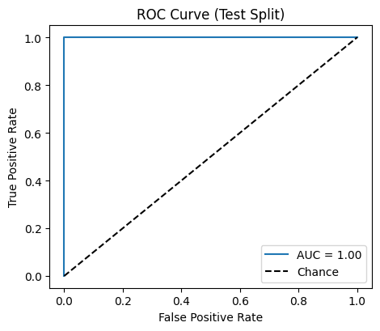
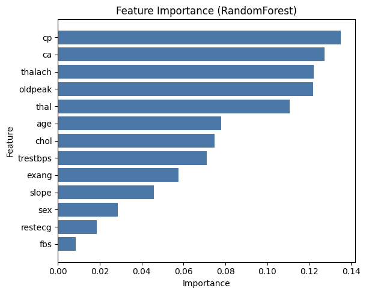

# Heart Disease Predictor

A practical machine learning project to predict the risk of heart disease using clinical and demographic attributes. This repository covers the full workflow: data loading, exploratory data analysis (EDA), feature engineering, model training and evaluation, with clear visualizations such as correlation heatmaps, class balance plots, confusion matrices, ROC curves, and feature importance charts.

## Why this project? (Theme and Problem)
Cardiovascular diseases remain a leading cause of mortality worldwide. Early and reliable risk prediction can guide interventions and reduce adverse outcomes. Given tabular clinical data (e.g., age, cholesterol, resting blood pressure, max heart rate, chest pain type), the goal is to build a robust model that predicts whether a patient is at risk of heart disease.

## Solution Overview
- Data: Structured tabular dataset with clinical attributes and binary target (heart disease yes/no).
- EDA: Visualize distributions, correlations, and class balance to understand data quality and signal.
- Preprocessing: Handle missing values, encode categorical features, scale numerical features.
- Modeling: Train and compare baseline and advanced models (e.g., Logistic Regression, Random Forest, XGBoost/SVC).
- Evaluation: Stratified cross-validation; accuracy, precision, recall, F1, ROC-AUC; confusion matrix and ROC curves.
- Interpretation: Feature importance (tree-based or permutation importance) to understand drivers of risk.

## Visualizations


- Confusion Matrix (Test Set)  
  

- ROC Curve  
  

- Feature Importance  
  

Tip: Save plots directly into this folder during EDA/modeling, for example:
```python
plt.tight_layout()
plt.savefig("assets/visuals/correlation_heatmap.png", dpi=200, bbox_inches="tight")
```

## Dataset
- Sources: UCI Heart Disease dataset or Kaggle variants with similar schema.
- Target variable: Binary heart disease indicator.
- Features: Age, sex, chest pain type (cp), resting blood pressure (trestbps), serum cholestoral (chol), fasting blood sugar (fbs), resting ECG (restecg), max heart rate (thalach), exercise-induced angina (exang), oldpeak, slope, number of major vessels (ca), thal, etc.
- Ensure feature names in your code match your dataset.

## Getting Started
1. Clone the repo:
   ```bash
   git clone https://github.com/samrat-codes/heartDiseasePredictor.git
   cd heartDiseasePredictor
   ```
2. Create environment and install dependencies (example):
   ```bash
   python -m venv .venv && source .venv/bin/activate # on Windows: .venv\Scripts\activate
   pip install -r requirements.txt
   ```
   If you don’t have a `requirements.txt`, typical libs:
   ```bash
   pip install numpy pandas scikit-learn matplotlib seaborn xgboost
   ```
3. Run EDA/Training:
   - If you use notebooks: open `notebooks/` and run the main notebook.
   - If you use scripts: run your training script, e.g.:
     ```bash
     python train.py
     ```
   Adjust to your actual file names.

## Project Structure (example)
```
heartDiseasePredictor/
├─ data/
│  └─ heart.csv                # your dataset (not committed if large)
├─ notebooks/
│  └─ eda_and_modeling.ipynb   # main exploration notebook
├─ src/
│  ├─ data.py                  # data loading/cleaning
│  ├─ features.py              # preprocessing/encoding/scaling
│  ├─ models.py                # model training/evaluation utilities
│  └─ utils.py
├─ assets/
│  └─ visuals/                 # save your figures here
│     ├─ correlation_heatmap.png
│     ├─ class_balance.png
│     ├─ confusion_matrix.png
│     ├─ roc_curve.png
│     └─ feature_importance.png
├─ requirements.txt
└─ README.md
```

## Evaluation and Metrics
- Cross-validation strategy: Stratified K-Fold (e.g., k=5) recommended.
- Report: Accuracy, Precision, Recall, F1, ROC-AUC.
- Visuals: Confusion matrix and ROC curve on holdout test set.

Example (replace with your actual results):
- Accuracy: —
- ROC-AUC: —
- Precision/Recall/F1: —

## Reproducibility
- Set random seeds where applicable (NumPy, scikit-learn).
- Keep preprocessing and modeling in a `Pipeline` to avoid data leakage and ensure consistent transforms.

## How to Export Visuals (snippet examples)
- Correlation Heatmap:
  ```python
  import seaborn as sns, matplotlib.pyplot as plt
  corr = df.corr(numeric_only=True)
  plt.figure(figsize=(10,8))
  sns.heatmap(corr, annot=False, cmap="RdBu_r", center=0)
  plt.title("Correlation Heatmap")
  plt.tight_layout()
  plt.savefig("assets/visuals/correlation_heatmap.png", dpi=200, bbox_inches="tight")
  ```
- Confusion Matrix:
  ```python
  from sklearn.metrics import ConfusionMatrixDisplay
  fig, ax = plt.subplots(figsize=(5,5))
  ConfusionMatrixDisplay.from_predictions(y_true, y_pred, ax=ax, cmap="Blues", colorbar=False)
  ax.set_title("Confusion Matrix (Test)")
  plt.tight_layout()
  plt.savefig("assets/visuals/confusion_matrix.png", dpi=200, bbox_inches="tight")
  ```
- ROC Curve:
  ```python
  from sklearn.metrics import RocCurveDisplay
  fig, ax = plt.subplots(figsize=(5,5))
  RocCurveDisplay.from_predictions(y_true, y_proba, ax=ax)
  ax.set_title("ROC Curve (Test)")
  plt.tight_layout()
  plt.savefig("assets/visuals/roc_curve.png", dpi=200, bbox_inches="tight")
  ```

## Roadmap
- Hyperparameter tuning (GridSearch/Optuna).
- Model comparison table.
- Calibration and decision thresholds.
- Model card with ethical considerations.

